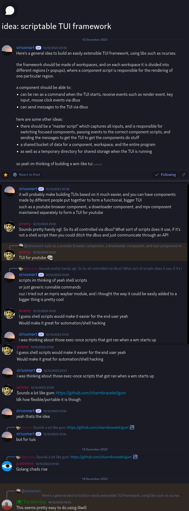

No more explanation for now.

If interested, reach out to me [siriusmart:matrix.org](https://matrix.to/#/@siriusmart:matrix.org) or on Discord.

## Showcase

To showcase what it can do, here's a small clip of writing a component which exits the canvas when `'q'` is pressed, and showing how ccanvas works in the process.

[Link to video](https://gmtex.siri.sh/fs/1/Dump/Showcases/ccanvas_2023-12-24.mp4)

Simplified version of stuff that happened:

1. ccanvas starts
2. Creates the master space `/1`
3. Loads a component as specified in command args at `/1/2`
4. Component subscribes to all key presses
5. Component tells the main canvas to exit when `'q'` is pressed

The end

## Idea

